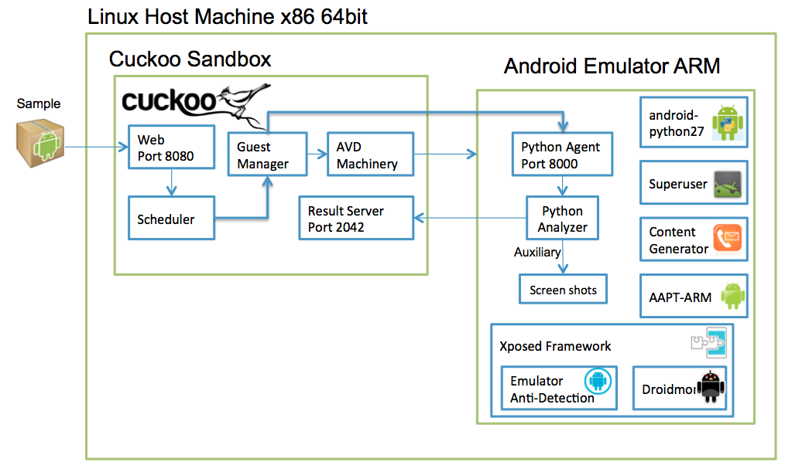

==========================
Guest Machine Architecture
==========================

Cuckoo Sandbox is a central management software for sample execution and analysis.
 
Each analysis is launched in a new and isolated virtual machine. Cuckoo’s infrastructure is composed of a host machine (the management software) and a number of guest machines (virtual machines that perform the analysis).
 
The host runs the core component of the sandbox that manages the entire analysis process, while the guests are the isolated environments where the malware samples are executed safely and then analyzed.
 
Each guest comprised of android emulator which is controlled by the machinery module avd.py. Additional components installed inside the emulator to support the analysis process are:
	* Python 2.7 compiled to arm.
	* Agent.py python script modified for the android emulator.
	* Android analyzer component that is sent to the guest machine at the beginning of the analysis.
	* Xposed - a framework for modules that can change the behavior of the system and apps without affecting any APKs. We created 2 additional modules with this framework:
	* Droidmon - Dalvik API call monitoring module.
	* Emulator anti-detection - a collection of known anti-detection techniques for hiding the android emulator.
	* Superuser app - grants and manages Superuser rights for your phone.  
	* Content Generator - generates a random contact list for a more realistic appearance.
	* AAPT Arm - Android asset packaging tool compiled to arm for extracting the main activity and package name from the APK.
	

